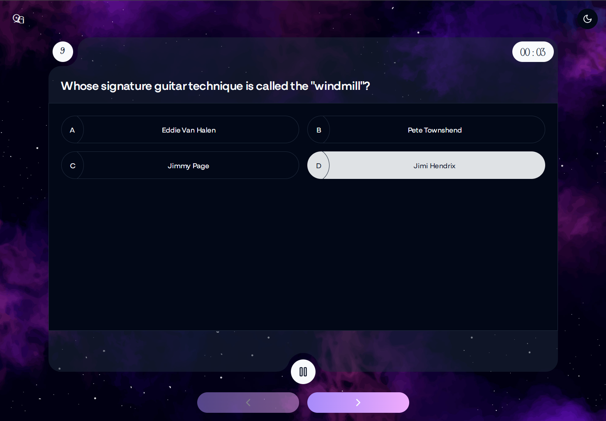

# Quizzz Game

Welcome to the magical ✨Quizzz Game✨! This project is a fun and interactive web-based quiz application that tests your knowledge on various topics. The game is designed to be user-friendly and interactive, providing an enjoyable experience for all ages.

## Table of Contents

- [Quizzz Game](#quizzz-game)
  - [Table of Contents](#table-of-contents)
  - [Introduction](#introduction)
  - [Features](#features)
  - [Screenshots](#screenshots)
  - [How to Play](#how-to-play)
  - [Technologies Used](#technologies-used)
  - [License](#license)
  - [Contact](#contact)

## Introduction

✨Quizzz Game✨ challenges users with a series of questions on different subjects. Users can select a Category, Difficulty, answer Multiple Choice or True/False questions, choose Number of Questions and see their scores at the end of the quiz. They can also set a Timer to challenge themselves and see the total time at the end.

## Features

- Multiple-choice questions on various topics
- Feedback on correct and incorrect answers at the end of each round
- Intuitive scoring system to track your progress
- Option to restart the quiz for another round of fun and learning
- Responsive design that works well on various devices

## Screenshots

## How to Play

See instructions [here](docs/how-to-play.md).

> [!TIP]
> Improve your browsing experience by switching themes using the animated switch icon at the top of the page.

## Technologies Used

- HTML5
- CSS3
- React
- TypeScript
- JavaScript (ES6+)
- Tailwind CSS
- Zustand
- Vite
- Vitest

## License

Quizzz Game is licensed under the MIT License. See the [LICENSE](LICENSE) file for details.

## Contact

If you have any questions or feedback, please feel free to contact me by:

- Email: <tatsiana.bunevich@gmail.com>
- GitHub: [TatsianaBunevich](https://github.com/TatsianaBunevich)
- Linkedin: [Tatsiana Bunevich](https://www.linkedin.com/in/tatsiana-bunevich/)

Happy quizzing! 🎉
